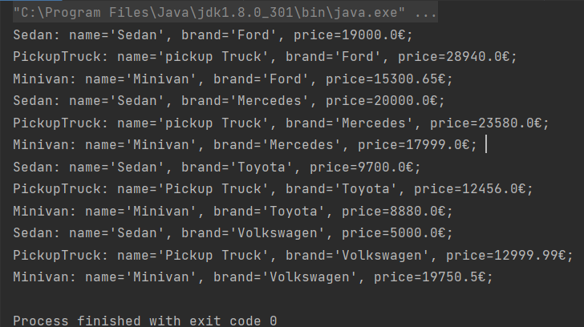

# TMPS
## Topic: Creational Design Patterns
#### Author: Osmătescu Antonina FAF-192
## Objectives
- Get familiar with the Creational DPs;
- Choose a specific domain;
- Implement at least 3 CDPs for the specific domain;
## Used Design Patterns
- Abstract Factory
- Singleton
- Factory Method
- Builder
## Implementation
In this laboratory work the objects *Minivan*, *PickupTruck* and *Sedan* were 
of type *Cars*, which contains three attributes, *toString*, 
*get* and *set* method.
<br>
**Builder Design Pattern** was used in the following way.
First, the factory is chosen by car brands and then in the
corresponding factory a builder class is chosen.
<br>The **Factory Methods** are placed in Builder package.
*MinivanBuilder*, *PickupTruckBuilder* and *SedanBuilder*
are classes which implement the interface.
<br>**Singleton Design Pattern** was implemented in
*FordFactory*, *MercedesFactory*, *ToyotaFactory*
and *VolkswagenFactory* classes. A static attribute 
was used
```private static volatile FordFactory fordFactory;```
```private static volatile MercedesFactory mercedesFactory;```
```private static volatile ToyotaFactory toyotaFactory;```
```private static volatile VolkswagenFactory volkswagenFactory;```
Then the constructor was declared as private, so that
the class could be instantiated only from static
*getInstance()* method:

```
public static FordFactory getFordFactory() {
        if (fordFactory == null)
            synchronized (FordFactory.class) {
                if (fordFactory == null)
                    fordFactory = new FordFactory();
            }
        return fordFactory;
```
Also, factories which implements the *BaseFactory* interface 
get the corresponding builder for each *brand*.
The process of creating different types of different brands 
is in the *Main* class.

## Results:
The output is represented below:
